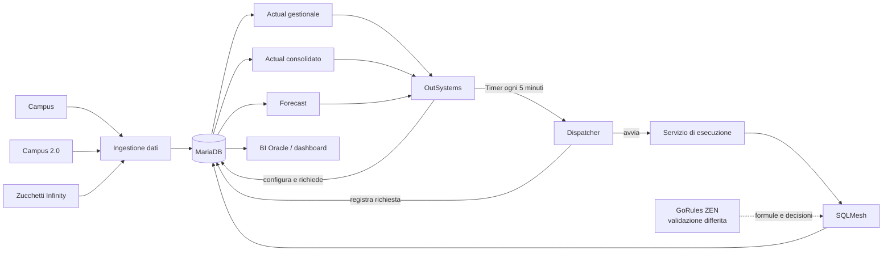
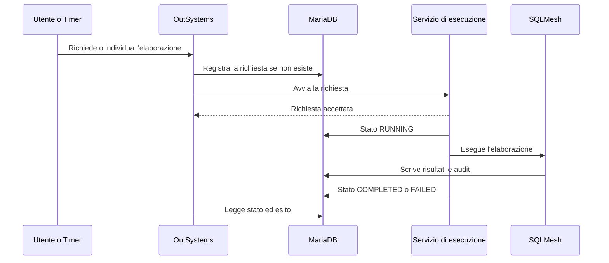

# Kiron CDG: panoramica architetturale

**Stato:** Active  
**Ambito:** architettura logica e responsabilità dei componenti  
**Principio guida:** [RFC-0001](https://github.com/ignazio-ingenito/agent-os/blob/main/rfcs/RFC-0001-principles.md)

## Scopo

Questo documento definisce i confini architetturali di Kiron CDG e guida le prossime decisioni tecniche.

Lo stato `Active` indica che l'architettura logica è approvata e applicabile al lavoro corrente. Le scelte ancora da verificare restano indicate come candidati e potranno essere confermate o scartate sulla base delle prove previste.

Il funzionamento del prodotto è descritto in [`product-overview.md`](product-overview.md).

## Decisioni confermate

- OutSystems è il frontend operativo.
- MariaDB `10.6.22-MariaDB-log` è l'unico database ed è self-managed dal cliente.
- La versione MariaDB presente dal cliente non è modificabile dal progetto. I componenti scelti devono funzionare correttamente su questa versione.
- Configurazioni, mapping, parametri e schedulazioni vengono gestiti in OutSystems e salvati in MariaDB.
- Le elaborazioni possono essere avviate manualmente o tramite Timer OutSystems.
- La risoluzione minima dei Timer è 5 minuti.
- MariaDB è il punto di pubblicazione di Actual e Forecast.
- BI Oracle accede direttamente ai dati pubblicati su MariaDB. Connessione, credenziali e rete verranno definite durante l'integrazione.
- SQLMesh è il motore scelto per le trasformazioni e il governo delle elaborazioni. La compatibilità funzionale con MariaDB 10.6.22 è stata verificata nel PoC tracciato dalla [issue #1](https://github.com/ignazio-ingenito/kiron-cdg/issues/1).
- Non verrà sviluppato un linguaggio proprietario per descrivere le formule.

GoRules ZEN resta un candidato da validare quando saranno disponibili formule e ribaltamenti reali.

## Architettura logica

## Responsabilità

### OutSystems

OutSystems gestisce:

- configurazioni, mapping e parametri;
- schedulazioni;
- avvio manuale delle elaborazioni;
- stato, anomalie ed esiti;
- consultazione di Actual e Forecast.

La logica di trasformazione e calcolo resta fuori da OutSystems.

### Timer e dispatcher

Un Timer OutSystems controlla ogni 5 minuti le schedulazioni attive in MariaDB. Quando trova un'elaborazione dovuta:

1. crea la richiesta, se non esiste già;
2. avvia il servizio di esecuzione;
3. termina senza attendere la fine del processo.

Le richieste manuali e schedulate seguono lo stesso percorso.

### MariaDB

MariaDB conserva:

- dati acquisiti e normalizzati;
- configurazioni, mapping, parametri e schedulazioni;
- richieste e stato delle elaborazioni;
- dati intermedi;
- Actual gestionale e consolidato;
- Forecast;
- anomalie, rettifiche, conguagli e audit;
- regole e relative versioni, quando saranno definite.

La separazione tra aree raw, normalizzate, di configurazione, output e audit è per ora logica. La struttura fisica verrà definita con il modello dati.

### Servizio di esecuzione

Il servizio separa le chiamate brevi di OutSystems dalle elaborazioni lunghe.

Deve:

- ricevere una richiesta;
- evitare prese in carico duplicate;
- avviare SQLMesh con periodo e parametri richiesti;
- aggiornare stato ed esito in MariaDB;
- restituire subito l'accettazione della richiesta.

Non gestisce le schedulazioni e non contiene formule Kiron. L'implementazione verrà definita durante la progettazione dell'integrazione con SQLMesh.

### SQLMesh

SQLMesh gestisce:

- dipendenze tra elaborazioni;
- normalizzazione e trasformazioni;
- aggregazioni, stime e ribaltamenti;
- riconciliazioni e delta;
- produzione di Actual e Forecast;
- intervalli elaborati e rielaborazioni selettive;
- audit e controlli sui dati;
- tracciabilità tecnica delle esecuzioni.

Il PoC ha verificato queste capacità di base su MariaDB 10.6.22. Prestazioni e comportamento sui volumi reali verranno misurati durante l'implementazione.

### GoRules ZEN

GoRules ZEN verrà valutato dopo l'ingestione dati, quando saranno disponibili formule e ribaltamenti reali.

La prova dovrà verificare che:

- rappresenti le regole senza introdurre un linguaggio proprietario;
- riduca sviluppo e manutenzione;
- mantenga precisione e tracciabilità adeguate;
- si integri senza workaround sproporzionati;
- sia adatto ai volumi da elaborare.

Se il vantaggio non sarà dimostrato, ZEN non verrà introdotto.

### BI Oracle e dashboard

Actual e Forecast vengono esposti tramite tabelle o viste stabili su MariaDB. BI Oracle accede direttamente a questi dati.

## Flusso di esecuzione

Gli stati iniziali sono `PENDING`, `RUNNING`, `COMPLETED` e `FAILED`. Altri stati verranno aggiunti solo in presenza di un requisito concreto.

## Validazione SQLMesh su MariaDB

Il PoC della [issue #1](https://github.com/ignazio-ingenito/kiron-cdg/issues/1) è stato eseguito con `mariadb:10.6.22` e `sqlmesh[mysql]` in Docker Compose, usando un Actual gestionale mensile coerente con il dominio Kiron.

Sono stati verificati:

- connessione tramite adapter MySQL;
- modello di staging;
- modello incrementale per periodo;
- elaborazione di gennaio e febbraio;
- rielaborazione selettiva di gennaio tramite restate;
- audit di unicità della grana;
- lettura del risultato finale, composto da sette righe aggregate senza duplicati.

Le correzioni necessarie hanno riguardato la creazione non interattiva dell'ambiente e il corretto riferimento alla tabella sorgente. Non richiedono workaround architetturali.

**Esito:** `SÌ`. SQLMesh è utilizzabile con MariaDB 10.6.22 per le capacità verificate.

La prova non copre la connessione all'istanza cliente, i vincoli di rete e sicurezza, né le prestazioni sui volumi reali. Questi aspetti verranno verificati durante l'integrazione e il dimensionamento delle elaborazioni.

## Decisioni e verifiche ancora aperte

- modalità di acquisizione da Campus, Campus 2.0 e Infinity;
- volumi e tempi attesi delle elaborazioni;
- dettagli tecnici di accesso di BI Oracle;
- contratto tra OutSystems e servizio di esecuzione;
- formule, riconciliazioni e ribaltamenti ancora da definire;
- utilità effettiva di GoRules ZEN.

Questi punti non modificano i confini architetturali approvati. Ogni scelta tecnica che ne dipende verrà presa dopo la relativa verifica.

## Gate tecnico GoRules ZEN

La validazione verrà aperta dopo l'ingestione dati e prima di sviluppare formule e ribaltamenti. Userà casi reali Kiron e gli stessi criteri di semplicità, beneficio verificabile e costo di integrazione.

## Aggiornamento del documento

Il documento verrà aggiornato quando una verifica modifica una scelta architetturale, conferma un candidato o ne determina l'esclusione. I dettagli di implementazione che non cambiano i confini restano fuori da questa panoramica.
