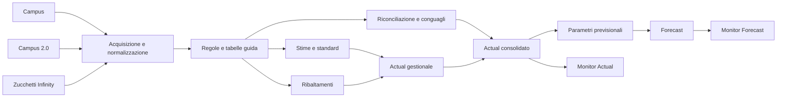
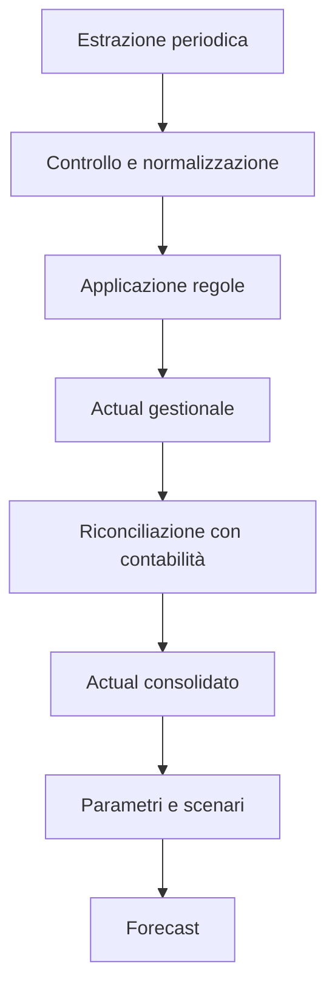
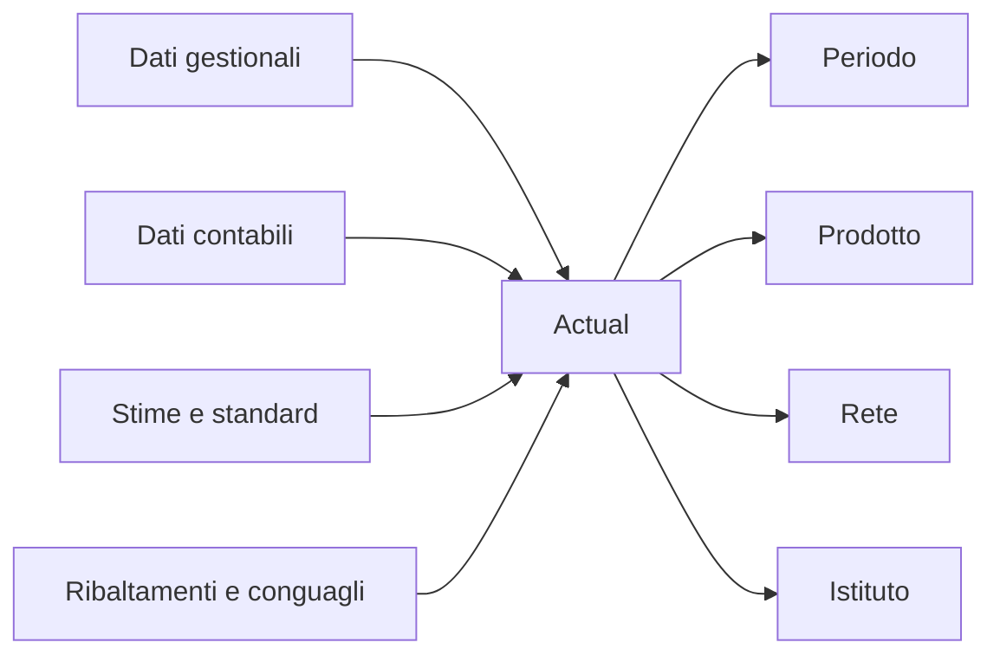
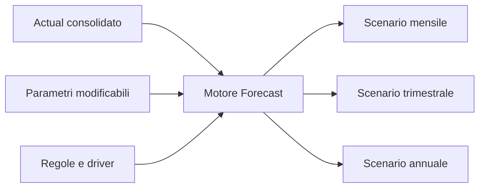
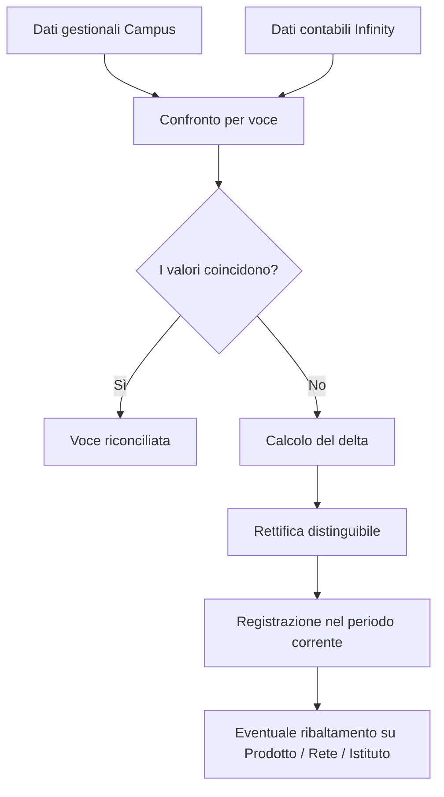

# Kiron CDG: panoramica funzionale

## Finalità del prodotto

Kiron CDG supporta il controllo di gestione attraverso una base dati unica per consuntivi e previsioni economiche.

Il prodotto raccoglie dati gestionali e contabili da sistemi diversi, li rende confrontabili e applica le regole necessarie per ottenere due risultati principali:

- **Actual**, il consuntivo mensile di ricavi e costi;
- **Forecast**, la previsione economica costruita a partire dai dati effettivi e da parametri aggiornabili.

L'obiettivo è ridurre le lavorazioni manuali, aumentare la qualità del dato e rendere chiaro il percorso che porta dalle fonti ai risultati esposti nelle dashboard direzionali.

## Il prodotto in una vista

In sintesi, Kiron CDG trasforma dati provenienti da più sistemi in informazioni economiche coerenti, tracciabili e utilizzabili per il controllo e la pianificazione.

## Chi utilizza i risultati

I principali destinatari sono le funzioni di Controllo di Gestione, Finance e Direzione.

Gli utenti devono poter:

- consultare dati economici coerenti e aggiornati;
- analizzare i risultati per periodo, prodotto, rete e istituto;
- verificare le differenze tra dati gestionali e contabili;
- controllare regole, parametri, rettifiche e conguagli;
- costruire e confrontare scenari previsionali;
- risalire all'origine di un valore e alle regole che lo hanno prodotto.

## Risultati prodotti

Kiron CDG produce tre basi informative principali.

| Risultato | Contenuto | Utilizzo |
|---|---|---|
| **Actual gestionale** | Dati gestionali e valori stimati | Prima vista mensile dell'andamento economico |
| **Actual consolidato** | Dati gestionali, contabili, standard, ribaltamenti e riconciliazioni | Consuntivo ufficiale per analisi e reporting |
| **Forecast** | Dati previsionali derivati dall'Actual e da parametri configurabili | Pianificazione e confronto degli scenari |

I risultati alimentano BI Oracle e le dashboard direzionali **Monitor Actual** e **Monitor Forecast**.

## Dimensioni di analisi

Le informazioni vengono organizzate almeno secondo queste dimensioni:

- periodo, anno e mese;
- prodotto e categoria prodotto;
- istituto;
- rete, collaboratore, gestore, tutor, senior, responsabile di area e agenzia Kiron;
- voce contabile e voce gestionale;
- mediazione.

La granularità centrale dell'Actual è **Periodo / Prodotto / Rete / Istituto**.

## Fonti informative

Kiron CDG utilizza principalmente tre sistemi.

### Campus

Fornisce dati gestionali relativi, tra gli altri, a:

- erogato;
- payin;
- payout;
- struttura e coordinamento della rete;
- progetto giovani.

### Campus 2.0

Fornisce informazioni provenienti dal Tool Incentive e dal Preventivatore, in particolare:

- incentivi;
- dominio e classificazione dei prodotti.

### Zucchetti Infinity

Fornisce:

- dati contabili;
- altri ricavi;
- costi non presenti nei sistemi gestionali;
- costi di struttura;
- informazioni necessarie alla riconciliazione.

Restano da confermare frequenza e modalità delle estrazioni, gestione delle modifiche successive e completezza dei tracciati disponibili.

## Come funziona il processo

Il processo può essere letto in tre passaggi principali.

### 1. Acquisizione dei dati

I dati vengono estratti periodicamente dai sistemi sorgente e caricati in un'area comune.

Per ogni caricamento deve essere chiaro:

- quale periodo rappresenta;
- quando è stato eseguito;
- quale versione della fonte è stata utilizzata;
- se i dati possono cambiare dopo l'acquisizione;
- come gestire eventuali correzioni successive.

### 2. Elaborazione

I dati vengono uniformati e completati attraverso regole e tabelle di supporto.

Le principali elaborazioni sono:

- normalizzazione di codici, campi e anagrafiche;
- applicazione di stime per valori non ancora disponibili;
- distribuzione di importi aggregati sulle dimensioni di analisi;
- confronto tra dati gestionali e contabili;
- registrazione di differenze, rettifiche e conguagli;
- calcolo del Forecast.

### 3. Produzione dei risultati

Il processo produce le basi dati Actual e Forecast e le rende disponibili alle dashboard direzionali.

## Actual

L'Actual rappresenta il consuntivo mensile.

Combina:

- dati gestionali;
- dati contabili;
- stime e standard;
- ribaltamenti;
- riconciliazioni e conguagli.

L'Actual deve permettere di distinguere il dato originario da ogni elaborazione successiva e di ricostruire come è stato ottenuto il valore finale.

## Forecast

Il Forecast parte da un Actual consolidato e applica parametri di previsione.

Le regole possono riguardare:

- crescita dell'erogato;
- redditività per cliente o istituto;
- quota per istituto;
- crescita rispetto all'anno precedente;
- crescita in cascata a partire da payin o erogato;
- incidenze storiche;
- variazione di payin, payout e costi di struttura;
- aliquota delle imposte.

Il risultato deve essere consultabile su base mensile, trimestrale e annuale.

Ogni scenario dovrebbe conservare:

- la versione del Forecast;
- il periodo Actual usato come punto di partenza;
- i parametri applicati;
- le regole e i driver utilizzati;
- la data di elaborazione.

## Regole e tabelle di supporto

Il prodotto utilizza tabelle guida per gestire anagrafiche, mapping e parametri.

| Tabella | Contenuto principale |
|---|---|
| **TG1** | Anagrafica prodotti |
| **TG2** | Anagrafica istituti |
| **TG3** | Anagrafica rete e agenti |
| **TG4** | Mappatura delle voci di bilancio |
| **TG5 / TG5.1** | Parametri standard |
| **TG6** | Dati necessari al Forecast |
| **TG7** | Periodicità delle riconciliazioni |

Per rendere il processo affidabile, regole e mapping devono essere:

- versionati;
- validi per un periodo definito;
- associati a un responsabile business;
- tracciabili rispetto agli output prodotti;
- modificabili senza perdere lo storico.

## Normalizzazione

La normalizzazione armonizza codici e campi provenienti da Campus, Campus 2.0 e Infinity verso un modello comune.

Comprende:

- dizionario dei campi;
- mapping tra fonte e campo comune;
- gestione di domini e anagrafiche;
- classificazione delle voci contabili e gestionali;
- gestione di scarti, dati mancanti e anomalie.

Le specificità Kiron riguardano soprattutto prodotti, istituti, gerarchie di rete e riclassificazione delle voci Infinity.

## Stime e conguagli

Alcuni valori non sono disponibili ogni mese oppure arrivano in un momento successivo.

In questi casi Kiron CDG applica una stima provvisoria. Quando arriva il dato effettivo, la differenza viene registrata come conguaglio.

Questo meccanismo riguarda, tra gli altri:

- Enasarco;
- FIRR;
- consulenza d'area;
- ricavi del progetto giovani;
- incentivi;
- rappel;
- imposte.

Ogni stima dovrebbe indicare parametro, base di calcolo, periodo di validità e stato di conferma.

## Ribaltamenti

Alcuni importi sono disponibili solo in forma aggregata e devono essere distribuiti sulle dimensioni di analisi.

La distribuzione avviene usando un driver, come payin, payout, erogato o payin di area.

Le regole già individuate comprendono:

| Regola | Descrizione sintetica | Driver principale |
|---|---|---|
| **RIB1** | Rappel | Payin mediazione creditizia |
| **RIB2** | Progetto giovani, rimborsi e payout collegati | Payin delle agenzie aderenti |
| **RIB3** | Altri ricavi e incentivi passivi | Payin |
| **RIB4** | Enasarco e FIRR | Payout mediazione creditizia |
| **RIB5** | Servizi di certificazione documentale | Erogato mutuo |
| **RIB6** | Consulenza d'area | Payin area |

Ogni regola di ribaltamento deve chiarire:

- quale importo viene distribuito;
- su quale perimetro;
- quale driver viene utilizzato;
- come viene calcolata l'incidenza;
- come vengono gestiti i valori non allocabili;
- come viene tracciato il calcolo.

Il criterio per il ribaltamento dei costi di struttura **CS1-CS10** deve ancora essere definito.

## Riconciliazione

La riconciliazione confronta i dati gestionali di Campus con i dati contabili di Infinity, normalmente a livello di voce di Conto Economico.

L'obiettivo è individuare e spiegare le differenze senza modificare retroattivamente i periodi già chiusi.

I principi emersi sono:

- i mesi chiusi non vengono riscritti;
- il delta viene registrato quando viene contabilizzato;
- il delta concorre al progressivo;
- il delta può essere distribuito fino al livello di prodotto, rete e istituto;
- la frequenza della riconciliazione può cambiare da una voce all'altra.

Restano da chiarire:

- quali campi usare per il confronto;
- con quale frequenza riconciliare ogni voce;
- quali soglie di tolleranza applicare;
- come distribuire eventuali differenze;
- quali effetti producono rettifiche e conguagli sui report esistenti.

## Tracciabilità e governo delle regole

Un valore finale deve poter essere ricostruito lungo tutto il percorso:

**fonte → normalizzazione → regola → eventuale stima o ribaltamento → riconciliazione → output**.

Per questo il prodotto deve conservare almeno:

- origine del dato;
- data e versione del caricamento;
- regola applicata;
- parametri e driver utilizzati;
- eventuali anomalie o scarti;
- rettifiche e conguagli;
- versione dell'Actual o del Forecast prodotto.

La tracciabilità consente di spiegare i risultati, ripetere un'elaborazione e verificare gli effetti di una modifica alle regole.

## Elementi comuni e specificità Kiron

Nel confronto con altre iniziative di controllo di gestione, alcune capacità possono essere condivise.

### Capacità riutilizzabili

- acquisizione periodica da fonti diverse;
- modello dati comune;
- normalizzazione tramite tabelle guida;
- parametri e regole configurabili;
- stime con successivo conguaglio;
- ribaltamenti basati su driver;
- riconciliazione e gestione dei delta;
- storicizzazione di dati e regole;
- produzione di Actual e Forecast;
- interfaccia per consultare e governare regole, parametri e anomalie.

### Specificità Kiron

- fonti Campus, Campus 2.0 e Infinity;
- modello di Conto Economico gestionale Kiron;
- granularità Periodo / Prodotto / Rete / Istituto;
- gerarchie della rete commerciale;
- riconciliazione Campus-Infinity;
- regole previsionali basate su erogato, payin, payout, istituti e prodotti.

Questa distinzione è importante: permette di riutilizzare meccanismi comuni senza perdere le regole proprie del dominio Kiron.

## Benefici attesi

### Qualità del dato

Unifica fonti diverse e rende più semplice individuare errori, dati mancanti e incongruenze.

### Trasparenza

Permette di capire come è stato ottenuto un valore e quali regole sono state applicate.

### Efficienza

Riduce attività manuali, passaggi su file e rielaborazioni ripetitive.

### Governo

Consente di gestire regole, parametri e mapping mantenendo responsabilità, validità e storico delle modifiche.

### Supporto alle decisioni

Mette a disposizione consuntivi e previsioni costruiti sulla stessa base informativa.

## Punti ancora aperti

Prima di completare l'analisi tecnica e trasformare i requisiti in attività di sviluppo, devono essere chiariti alcuni aspetti:

- frequenza e modalità delle estrazioni da Campus;
- regole di consolidamento e gestione delle variazioni successive;
- data di riferimento usata per aggregare le misure Campus e Campus 2.0;
- completezza dei dati mensili e progressivi disponibili in Infinity;
- campi necessari alla riconciliazione Campus-Infinity;
- criteri, frequenza e soglie della riconciliazione;
- gestione e distribuzione delle differenze;
- impatto di rettifiche e conguagli sui report esistenti;
- regole per il ribaltamento dei costi di struttura CS1-CS10;
- classificazione delle stime ancora non definite;
- gestione dei parametri Forecast su più livelli di dettaglio;
- livello di configurabilità richiesto per il Forecast.

Questi punti non impediscono di comprendere la finalità del prodotto, ma devono essere risolti prima di definire in modo affidabile soluzione tecnica, effort e piano di realizzazione.

## Sintesi

Kiron CDG costruisce una vista economica comune, controllata e tracciabile.

Integra dati gestionali e contabili, produce consuntivi e previsioni e governa regole, stime, ribaltamenti, differenze e aggiornamenti nel tempo.

La direzione funzionale è chiara. Le decisioni ancora aperte riguardano soprattutto modalità operative, criteri di riconciliazione, regole non ancora definite e livello di configurabilità del Forecast.